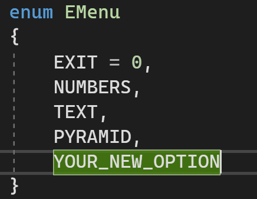
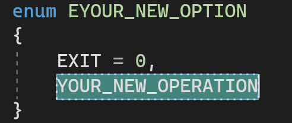
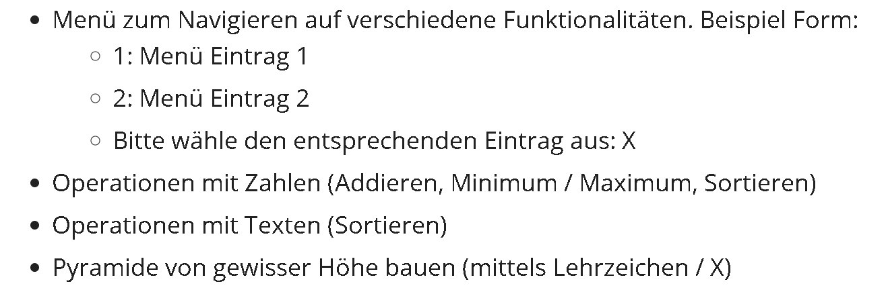
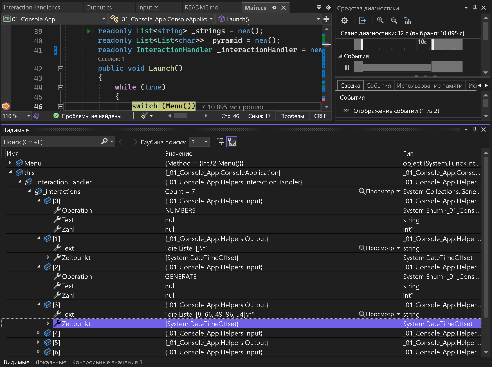

# Console Apllication

## Justification
- To scale the app with new menu options:  
> Add your new option in Menu enum  
  
> Create your enum with operations  

- Input of numbers  
Operations with numbers are assumed to be with integers only.
- Task 1  

The main functionallity is based on collections and operations upon them.
So method "Addieren" in first option of menu could have 2 meanings:
 a) 5 + 1 = 6 ❌
 b) calculate sum (<u>add</u> all numbers) ✅  
I don't see the sense of implementing 1 operation from calculator in application that works with collections

- Task 2  	
Current arhitecture allows to debug by tracing operations list `_interactionHandler`

## My working notes
App has 3 user intractions: 				

1. Input  		

	- Menu option  		

	- Value (number/string/number of stars)	

2. Result output (list + additional info about modification)
*sometimes additional info can be called in different place from list	

3. Formatting output (ask for input, cleaning)

## Author
Yaroslav Zhyvotovskyi